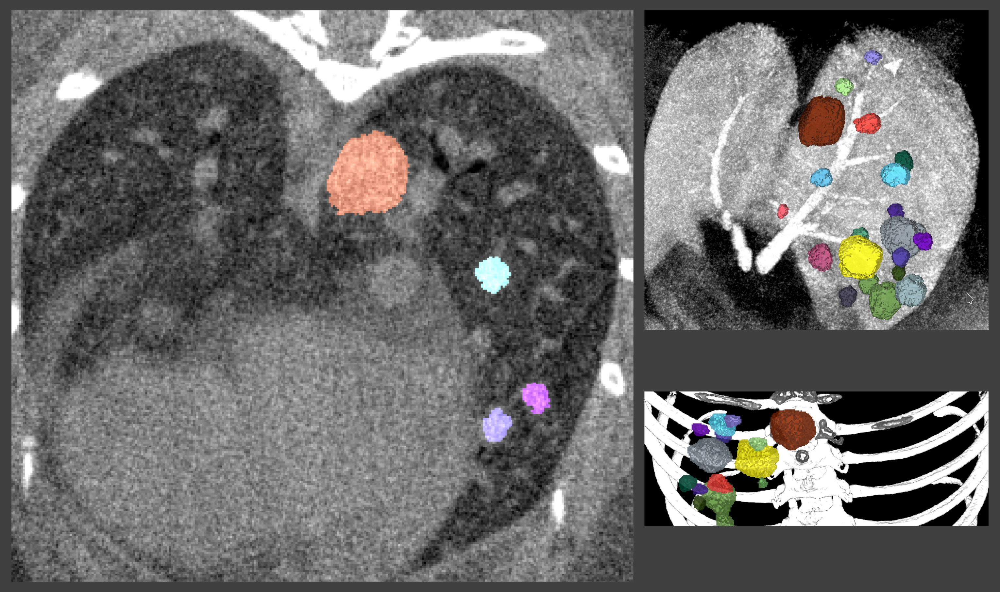
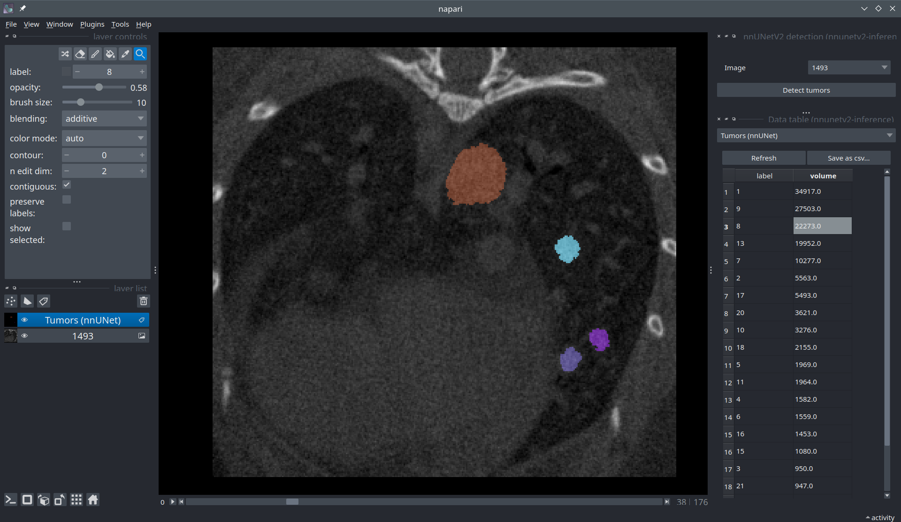

# Lung tumor nodules segmentation in mice CT scans

We provide a neural network model for lung tumor nodule segmentation in mice. The model is based on the [nnUNet](https://github.com/MIC-DKFZ/nnUNet) framework which we used in the full resolution 3D configuration (3d_fullres).



This model is intended as a tool to facilitate the annotation of individual lung tumor nodules in mouse CT scans. The nnUNet model outputs a binary mask representing the foreground tumor class. In our pipeline, we further separate individual nodule instances by connected components labeling and remove small objects based on a minimum size threshold of 150 pixels.

To use this model in your own work, please check that your use case fulfills the [input data requirements]() and that you have access to [suitable hardware](). Then, follow our [installation]() and [usage]() instructions.

## Input data requirements

Make sure that your input data is compatible with our model. Read [Input data requirements](documentation/data_requirements.md).

An example image is available for download at [link]().

## Hardware requirements

Installing both PyTorch and TorchVision with CUDA support and using a modern GPU for inference is strongly recommended.

We report the following runtimes for inference on our [example image]() size (...).

- GPU - RTX 3060 (12 GB RAM): ~ X sec.
- CPU: ~ X sec.

## Installation

We recommend performing the installation in a clean Python environment.

The code requires `python>=3.9`, as well as `pytorch>=2.0`. 

Install from the repository:

```
pip install git+https://gitlab.epfl.ch/center-for-imaging/mousetumornet.git
```

or clone the repository and install with:

```
git clone git+https://gitlab.epfl.ch/center-for-imaging/mousetumornet.git
cd mousetumornet
pip install -e .
```

## Models

The model weights (~230 MB) are automatically downloaded from Zenodo the first time you run inference. The model files get saved locally in the `models` subfolder.

Updated versions of the model trained on more annotated data are likely to be released in the future. As of June 2023, the available models are:

- Model-v1.0
- Model-v2.0

## Usage in Napari

[Napari](https://napari.org/stable/) is a multi-dimensional image viewer for python. To use our model in Napari, start the viewer with

```
napari
```

To open an image, use `File > Open files` or drag-and-drop an image into the viewer window. If you want to open medical image formats such as NIFTI directly, consider installing the [napari-medical-image-formats](https://pypi.org/project/napari-medical-image-formats/) plugin.

Next, in the menu bar select `Plugins > mousetumornet > Tumor detection`. Run the model on your selected image by pressing the "Detect tumors" button.



To inspect the results, you can bring in a table representing the detected objects from `Plugins > napari-label-focus > Data table`. Clicking on the data table rows will focus the viewer on the selected object.

## Usage as a library

You can use the model in just a few lines of code to produce a segmentation mask from an image (represented as a numpy array).

```
from mousetumornet import predict, postprocess

binary_mask = predict(your_image)
instances_mask = postprocess(binary_mask)
```

## Usage as a CLI

[To be updated]
You can run inference on a batch of images in a given folder, as long as the images are saved in the [nnUNet dataset format](https://github.com/MIC-DKFZ/nnUNet/blob/master/documentation/dataset_format.md). For example:

```
input_folder/
    ├── your_image_0000.nii.gz
    ├── your_image_0001.nii.gz
    ├── your_image_0002.nii.gz
output_folder/
```
In this case, use: 

```
nnUNetv2_predict -i input_folder -o output_folder
```

## Usage recommendation

For use in a scientific context, we believe the model outputs should be considered as an initial guess for the segmentation and not as a definitive result. Certain deviations in the the instrumentation, acquisition parameters, or morphology of the tumor nodules, among other things, can affect performance of the model. Therefore, the detections should always be reviewed by human experts and corrected when necessary.

## Dataset

Our model was trained on 493 images from Y separate experiments and validated on 97 images. The data was annotated by Z independent experts from Prof. De Palma's lab in EPFL. The images were acquired over a period of about 12 months using two different CT scanners. In this dataset, we report a dice score performance of 0.63 on the validation images.

The dataset is avaiable for download on [Zenodo](). By downlodading the dataset you agree that you have read and accepted the terms of the [dataset license]().

## Disclaimer

The software is provided "as is", without warranty of any kind, express or implied, including but not limited to the warranties of merchantability, fitness for a particular purpose and noninfringement. In no event shall the authors or copyright holders be liable for any claim, damages or other liability, whether in an action of contract, tort or otherwise, arising from, out of or in connection with the software or the use or other dealings in the software.

## Roadmap

We are planning to further train...

## License

This model is licensed under the [BSD-3](LICENSE.txt) license.

## Carbon footprint of this project

As per the online tool [*Green algorithms*](http://calculator.green-algorithms.org/), the footprint of training the mouse tumor net model was estimated to be 105 g CO2e.

## Citing

Please use the following BibTeX entry to cite this project:

```
article
```