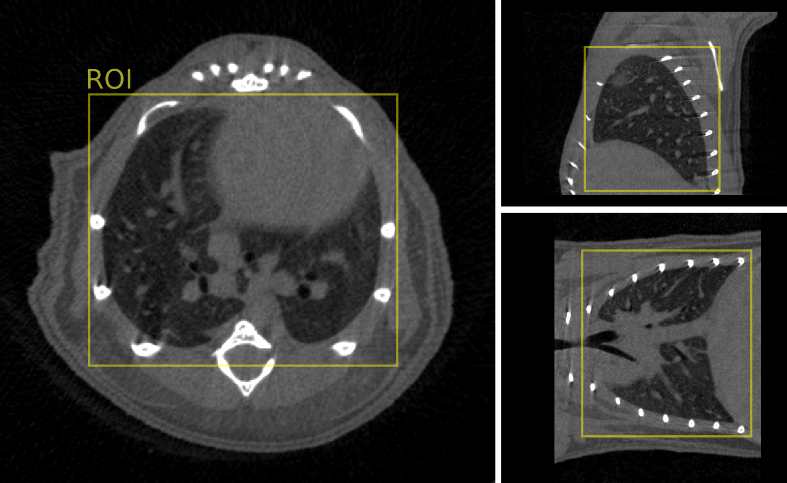

# Input data requirements

## Imaging modality and acquisition

We used two different CT scanners to produce training images.

*The voxel resolution was [...] and [Other specs]*.

## Region of interest

Our model requires to provide as input image only the region of interest (ROI) surrounding the lungs parenchima. This volume gets resampled to a size of 256 x 256 x 256 pixels as preprocessing.

We've made this decision so that users would not have to provide spacing or pixel size values to the model; only an image that covers the anatomical region of interest. Moreover, by standardizing the input image size, inference time is the same regardless of the pixel resolution of the scans.

We tested the model on regions of interest (ROIs) in the lung parenchima area, which we have extracted from larger images. A ROI corresponds to the smallest crop that fully encompasses the lungs. While ROIs can be extracted manually, to build our datasets we have used a custom-built image processing script to detect and extract the ROIs automatically.

## Pixel size

Our model can accomodate different images of different pixel sizes.

(Updated) What matters is that the input image covers the bounding box of the lungs. The images get rescaled to a fixed size during preprocessing.

(Outdated) The minimum size should be (128 x 128 x 128) pixels, which is the size of the neural network receptive field. Bigger images are processed in tiles. At the scan resolution used for training the model (which is [xxx]), the size of ROIs around the lungs is about (300 x 300 x 300) pixels.

## Intensity normalization

We apply a quantile-based intensity normalization to each image independently as a preprocessing step. We set the minimum and maximum intensities respectively at the 2nd and 98th percentile. This ensures that most of the graylevel intensities fall within the range 0-1. This preprocessing is done internally in the nnUNet model framework, which we have modified to integrate this preprocessing.

## Image orientation

The image axis order (ZYX, XYZ...) does not matter. We integrated random flipping, mirroring, and image transpose operations as augmentations during training, hence the model is capable of handling these variations.

## (Optional) Automatic evaluation of the input data integrity

Is that possible?