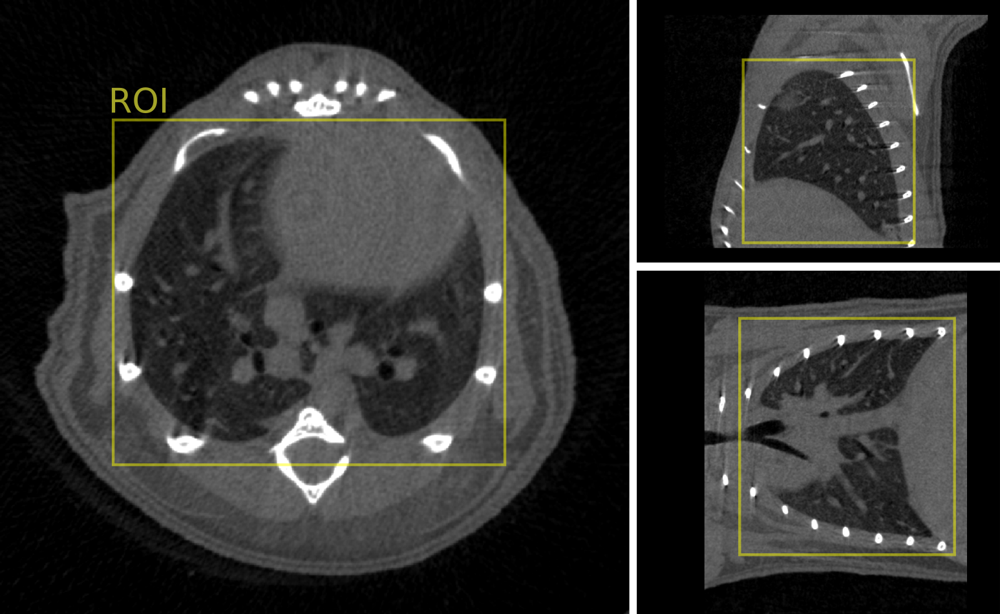

# Input data specifications

## Imaging modality and acquisition

We used two different CT scanners to produce training images.

*The voxel resolution was [...] and [Other specs]*.

## Region of interest

The input image to our model should be a 3D region of interest (ROI) covering the lungs parenchima. This volume gets resampled to a size of 256 x 256 x 256 pixels as preprocessing. If necessary, the ROIs should be cropped out from larger images so that they correspond to a volume that closely, but fully, encompasses the lungs.

Here is an example:

<p align="center">
    
</p>

The ROIs can be extracted manually or automatically using image processing. [TODO] As an example, we provide a script `mtn_extract_roi` that uses intensity thresholding to extract regions of interest.

```
mtn_extract_roi -i /path/to/image.tif
```

This will save a ROI image in the folder.

```
folder/
    ├── image.tif
    ├── image_roi.tif
```

## Pixel size

As the images get rescaled to a fixed size during preprocessing, our model can accomodate different images of different pixel sizes. What matters is that the ROI is selected correctly, so that the input image covers the bounding box of the lungs.

## Intensity normalization

We apply a quantile-based intensity normalization to each image independently as a preprocessing step. We set the minimum and maximum intensities respectively at the 2nd and 98th percentile. This ensures that most of the graylevel intensities fall within the range 0-1. This preprocessing is done internally in the nnUNet model framework, which we have modified to integrate this preprocessing.

## Image orientation

The image axis order (ZYX, XYZ...) does not matter. We integrated random flipping, mirroring, and image transpose operations as augmentations during training, hence the model is capable of handling these variations.
